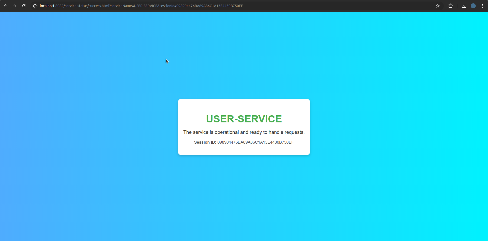

# WORKAGER
## 🎯 Goals
This project aims to:

- 📚 Help me practice and learn industry-standard best practices across the stack.
- ⚙️ Serve as a base template for future projects, reducing setup time and ensuring quality.
- 💡 Allow flexibility in deployment architecture (monolithic or microservices) to fit different project needs.

## Contribution Guidelines

### Commit Message Guidelines

To maintain consistency, please format your commit messages as follows:

`<prefix>(<module>): <description> [issue#]`

- **prefix**: Allowed prefixes [`feat`, `setup`, `test`, `fix`, `version`].
- **module**: Name of the module affected (alphanumeric, underscores, or hyphens). e.g., app, ui, user-service, etc.
- **description**: Brief description up to 140 characters.
- **issue#**: (optional) Issue number. e.g., issue#21

**Example:**
`feat(auth): add JWT authentication [issue#21]`
## Local Development Environment 🛠️

### Prerequisites 📋
- Java 17 or higher
- Maven 3.8+
- Node.js 18+ and npm
- Angular CLI
- Docker/Podman
- MySQL 8.0
- Git

### Setting Up Local Environment 🚀

#### 1. Database Setup 💾
Start the MySQL container using Podman:
```bash
podman run -d \
  --name mysql-workager \
  -e MYSQL_ROOT_PASSWORD=root \
  -e MYSQL_DATABASE=workager \
  -p 3308:3306 \
  -v /path/to/local/mysql-data:/var/lib/mysql \
  docker.io/library/mysql:8.0
```

#### 2. Building Service Images 🏗️
Navigate to each service directory and build its Docker image:
```bash
cd path/to/service
docker build -t your-image-name .
```

#### 3. Building the Project
From the root directory, build all modules:
```bash
mvn clean install
```

#### 4. Running the Services ▶️
Start individual Spring Boot services:
```bash
*** Make sure lib has been built first ***
cd app/[service-name]
mvn spring-boot:run
```

#### 5. Running the UI 🖥️
Start the Angular development server:
```bash
cd ui
ng serve
```

### Verification ✅
Test if services are running correctly by accessing these endpoints:

- Health Check 🩺:
    - e.g., User service:
        ```
            http://localhost:8082/api/v1/test/user/

        ```
        Expected response:

        


### Project Structure 📂
```
workager/
│
├── app/
│   │
│   ├── auth-service/
│   │
│   └── user-service/
│
├── assets/
│
├── ui/
│
└── lib/
    │
    ├── java/
    │   │
    │   ├── constants/
    │   │
    │   ├── entities/
    │   │
    │   ├── enums/
    │   │
    │   ├── payloads/
    │   │
    │   └── repositories/
    │
    └── resources/
        │
        └── global-application-config.yml


```

### Common Issues ⚠️
- If port 3308 is already in use, modify the port mapping in the MySQL container command
- Ensure all required ports are free before starting services
- Check Docker/Podman daemon is running before container operations
- If using podman instead of docker, add following in /etc/containers/registries.conf
    ```
        unqualified-search-registries = ["docker.io"]
    ```

### Additional Commands 💻
- Stop MySQL container: `podman stop mysql-workager`
- Remove MySQL container: `podman rm mysql-workager`
- Clean and build specific service: `cd app/[service-name] && mvn clean install`